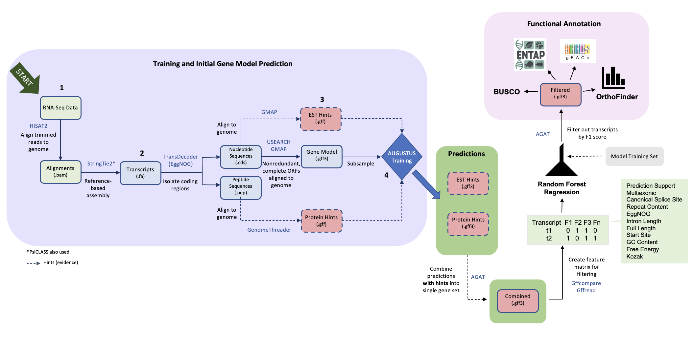

## Method

EASEL is a pipeline that relies on several methods and subworkflows. Here, each step of the method is described in terms of its input and output, and what is being accomplished at each step in the workflow.

1. [Data gathering](#data-gathering)
2. [Training and initial gene model prediction](#training-and-initial-gene-model-prediction)
- [Gene models for AUGUSTUS training](https://gitlab.com/PlantGenomicsLab/easel-augustus-training/-/blob/main/Files/2_generating_gene_models.md)
- [Generating hints for AUGUSTUS prediction](https://gitlab.com/PlantGenomicsLab/easel-augustus-training/-/blob/main/Files/3_hints_for_augustus.md)
- [AUGUSTUS prediction with hints](https://gitlab.com/PlantGenomicsLab/easel-augustus-training/-/blob/main/Files/4_Augustus_with_hints.md)
3. [Augustus ab initio predictions](#augustus-ab-initio-predictions)
4. [Merging predictions](#merging-predicitons)
6. [Evaluation](https://gitlab.com/PlantGenomicsLab/easel-augustus-training/-/blob/main/Files/6_evaluation.md)
7. [Results](https://gitlab.com/PlantGenomicsLab/easel-augustus-training/-/blob/main/Files/7_Results.md)

## Data Gathering

Gene model predictions are primarity generated through aligning transcriptomic data to soft-masked reference genome sequences and *ab initio* prediction ([1](#1.)). EASEL takes as input: 
- soft-masked reference genome (.fa)
- Paired-end RNA-Seq reads (SRA accession numbers or as .fastq)

For the workshop we'll be using the [Boxelder chromosome 1]() as the reference genome

## Training and initial gene model prediction

## Augustus ab initio predictions

## Merging predictions

## References / Repositories

Links to citations and repositories for software used in EASEL pipeline.

1. [Yandell, Mark, and Daniel Ence. "A beginner's guide to eukaryotic genome annotation." Nature Reviews Genetics 13.5 (2012): 329-342.](https://www.nature.com/articles/nrg3174)
2. 
2. 
2. 