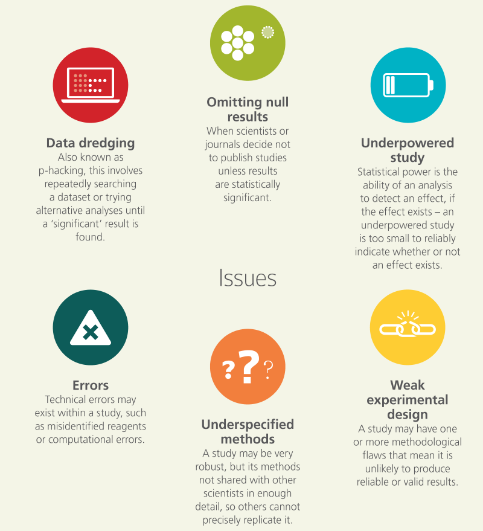
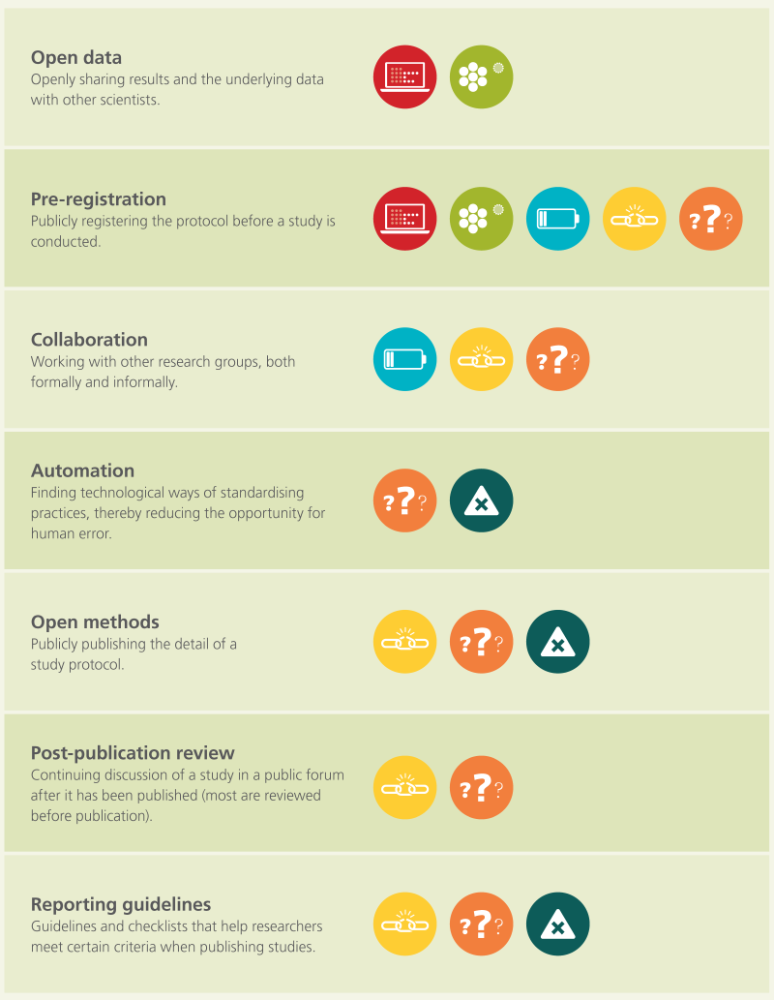

# Transparent, Reproducible and Open Research

Numerous problems threaten the integrity, credibility, and utility of research. Improving reproducibility will ensure that research is as efficient and productive as possible. The following figure (_retrieved from the report of the symposium, "Reproducibility and reliability of biomedical research", organised by the Academy of Medical Sciences, BBSRC, MRC and Wellcome Trust in April 2015. The full report is available from [here](http://www.acmedsci.ac.uk/)_) summarizes aspects of the conduct of research that can cause irreproducible results, and potential strategies for counteracting poor practice in these areas. Overarching factors can further contribute to the causes of irreproducibility, but can also drive the implementation of specific measures to address these causes. The culture and environment in which research takes place is an important ‘top-down’ overarching factor. From a ‘bottom-up’ perspective, continuing education and training for researchers can raise awareness and disseminate good practice.

Here we will address the three main pillars, i.e. Transparency, Reproducibility and Openness, along with some strategies best outlined in the following figure.

## Transparency

Questions to ask yourself:
- What is the nature/purpose of this best practice?
- When should I use it?
- How does its use differ by the nature of a research study?

Researcher degrees of freedom (_Wicherts et al. 2017_)
- Formulating hypotheses
  - Hypothesizing After Results are Known (HARKing, Kerr, 1988)
- Designing the study
  - Create flexibility
  - Dependent and independent variables
  - Exclusion of participants
  - Power and sample size
    - Studies are often underpowered
      - The risk of bias is larger in underpowered studies
      - Intuitions about power are often flawed (Bakker et al. 2016)
- Running the study
  - Correcting, coding or discarding data during data collection in a non-blinded manner
  - Determining the data collection stopping rule on the basis of desired results or intermediate significance testing
- Analyzing the data
  - Choosing between different options of dealing with incomplete or missing data or ad hoc grounds
  - Specifying pre-processing of data (e.g. cleaning, normalization, smoothing, motion correction) in an ad hoc manner
  - Deciding on how to deal with violations of statistical assumptions in an ad hoc manner
  - Deciding on how to deal with outliers in an ad hoc manner
- Reporting the study
  - Failing to assure reproducibility
  - Failing to assure replication
  - Failing to report so-called "failed studies" that were originally deemed relevant to the research question
  - Misreporting results and p-values
  - Hypothesizing After Results are Known (HARKing, Kerr, 1988)

Biases
A researcher performs the data-analysis:
- He/she is aware of the study’s main hypothesis,
- He/she is likely to believe this hypothesis, and
- He/she often benefits directly from finding support for it.

Fugelsanget al. (2004)
- dismiss the inconsistent data on methodological grounds,
- _while data consistent with a theory [were] met with little scrutiny_

Schimmack(2012)
- Empirical studies no longer test theoretical hypotheses because they can only produce two results: Either they support the theory (p < .05) or the manipulation did not work (p > .05).

## Questionable Research Practice

Data from [John, L. K., Loewenstein, G., & Prelec, D. (2012). "_Measuring the prevalence of questionable research practices with incentives for truth telling_", Psychological science, 0956797611430953](http://journals.sagepub.com/doi/abs/10.1177/0956797611430953).

- Failing to report all of a study’s dependent measures (_63.4%_)
- Deciding whether to collect more data after looking to see whether the results were significant (_55.9%_)
- Failing to report all of a study’s conditions (_27.7%_)
- Stopping collecting data if the result is already significant (_15.6%_)
- Rounding off" a p value (e.g.  p = .054, report p < .05) (_22.0%_)
- Selectively reporting studies that ‘worked’ (_45.8%_)
- Deciding whether to exclude data after looking at the impact of doing so on the results. (_38.2%_)
- Reporting an unexpected finding as having been predicted from the start (_27.0%_)
- Claiming that results are unaffected by demographic variables when one is unsure (or knows that they do) (_3.0%_)
- Falsifying data (_0.6%_)

## Reproducibility

While understanding the full complement of factors that contribute to reproducibility is important, it can also be hard to break down these factors into steps that can immediately be adopted into an existing research program and immediately improve its reproducibility. One of the first steps to take is to assess the current state of affairs, and to track improvement as steps are taken to increase reproducibility even more.

Goodman, Fanelli, & Ioannidis (2016) note that in epidemiology, computational biology, economics, and clinical trials, reproducibility is often defined as:

> the ability of a researcher to duplicate the results of a prior study using the same materials as were used by the original investigator. That is, a second researcher might use the same raw data to build the same analysis files and implement the same statistical analysis in an attempt to yield the same results.

This is distinct from replicability:

> which refers to the ability of a researcher to duplicate the results of a prior study if the same procedures are followed but new data are collected.

Reproducibility can be assessed at several different levels: at the level of an individual project (e.g., a paper, an experiment, a method or a dataset), an individual researcher, a lab or research group, an institution, or even a research field. Slightly different kinds of criteria and points of assessment might apply to these different levels. For example, an institution upholds reproducibility practices if it institutes policies that reward researchers who conduct reproducible research. Meanwhile, a research field might be considered to have a higher level of reproducibility if it develops community-maintained resources that promote and enable reproducible research practices, such as data repositories, or common data-sharing standards.

### Automation and provenance tracking

Automation of the research process means that the main steps in the project: transformations of the data -- various processing steps and calculations -- as well as the visualization steps that lead to the important inferences, are encoded in software and documented in such a way that they can reliably and mechanically be replicated. In other words, the conclusions and illustrations that appear in the article are the result of a set of computational routines, or scripts that can be examined by others, and re-run to reproduce these results.

### Availability of software and data

The public availability of the data and software are key components of computational reproducibility. To facilitate its evaluation, we suggest that researchers consider the following series of questions.

#### Data

- Are the data available through an openly accessible database?
- Are the data shared in a commonly used and well-documented file format?
- If community standards exist, are files laid out in the shared database in a manner that conforms with these standards?
- If data are updated, are different versions of the data clearly denoted? If data is processed in your analysis, is the raw data available?
- Is sufficient metadata provided?
If the data are not directly available, for example if the data are too large to share conveniently, or have restrictions related to privacy issues, do you provide sufficient instructions to obtain equivalent data?

#### Software

- Is the software available to download and install?
- Can the software easily be installed on different platforms?
- Does the software have conditions on the use?
- Is the source code available for inspection?
- Is the full history of the source code available for inspection through a publicly available version history?
- Are the dependencies of the software (hardware and software) described properly? Do these dependencies require only a reasonably minimal amount of effort to obtain and use?

## Open reporting of results

Crucial to reproducing a study is providing sufficient details about its execution through reports, papers, lab notebooks, etc. Researchers usually aim to publish their results in journals (or conference proceedings) with the aim to broadly distribute their discoveries. However, the choice of a journal may affect the availability and accessibility of their findings. Open access journals allow readers to access articles (usually online) without requiring any subscription or fees. While open access can take many forms, there are two common types of open access publication:

- **green access** - the journal charges a subscription fee to readers for access to its contents, but allows the author to post a version of their article (preprint/postprint) on an electronic print website such as arXiv, EPrints Archive, on their own website, or on a institutional repository.

- **gold access** - the journal does not charge any fees to readers, and makes a freely accessible online version of the article available at the time of publishing. Usually the author pays an article processing charge to enable free access by readers.

Clearly gold access journals provide the easiest and most reliable access to the article. However, since there are no subscription fees to cover publishing costs at gold open access journals and articles, the author is required to pay. Often the amount is over a thousand dollars per article. As a compromise, journals sometimes have an embargo on open access (delayed open access), i.e. there is a period of time during which the article cannot be freely accessed, after which either the journal automatically makes the article available or the authors are allowed to self-archive it.

Green open access is an attractive approach to making articles openly available because it is affordable to both readers and authors. According to a study of a random sample of articles in 2009 (Björk, Welling, Laakso, Majlender, & Guðnason, 2010), approximately 20% of the articles were freely accessible (9.8 % on publishers' websites and 11.9% elsewhere through search). A more recent larger study (Archambault et al., 2013) indicates that 43% of Scopus indexed papers between 2008 and 2011 were freely available by the end of 2012. It has been also shown that there is a substantial growth in the proportion of available articles. However, there are still many articles which have been given a green light for access, but they have not been self-archived. Thus it is important for authors to understand the journal's publishing policy and use the available resources (within their field, institution, and beyond) to make their work accessible to a wide audience. Many research-intensive universities, usually via the libraries, provide services to help researchers self-archive their publications.

There are many other methods for sharing research online at different stages of the work (before final results are even available). Preregistration of the hypotheses that are being tested in a study can prevent overly flexible analysis practices and HARKing (hypothesizing after results are known (Kerr, 1998)), which reduce the reproducibility of the results reported. Regular public updates can be achieved through electronic lab notebooks, wiki pages, presentation slides, blog posts, technical reports, preprints, etc. Sharing progress allows for quick dissemination of ideas, easy collaboration, and early detection and correction of flaws. Storing preliminary results and supplementary materials in centralized repositories (preregistration registries, public version control repositories, institutional reports) have potential to improve the discoverability and the availability lifespan of the works. Some important questions researchers can ask when evaluating publishing solutions include:

Taking into account the sustainability and the ease of access of these solutions in the decision process is integral to improving the research reproducibility. There is also empirical evidence that publication in open access promotes the downstream use of the scientific findings, as evidenced by an approximately 10% increase in citations (Hajjem, Harnad, & Gingras, 2006) (and see also http://opcit.eprints.org/oacitation-biblio.html).

## References / Sources

Sources for all the above details include the following:

- [The Practice of Reproducible Research](https://www.practicereproducibleresearch.org)
- [BITSS 2017 Research Transparency and Reproducibility Training (RT2) - London](https://osf.io/cdfh7/)
- [Marjan Bakker, _Tilburg University_, "Scientific Misconduct and Researcher Degrees of Freedom"](https://mfr.osf.io/render?url=https://osf.io/nrsvu/?action=download%26mode=render)
- [Munafò et al. (2017). A manifesto for reproducible science. Nature Human Behaviour](https://www.nature.com/articles/s41562-016-0021)
- [Reproducibility and reliability of biomedical research](https://acmedsci.ac.uk/policy/policy-projects/reproducibility-and-reliability-of-biomedical-research)
