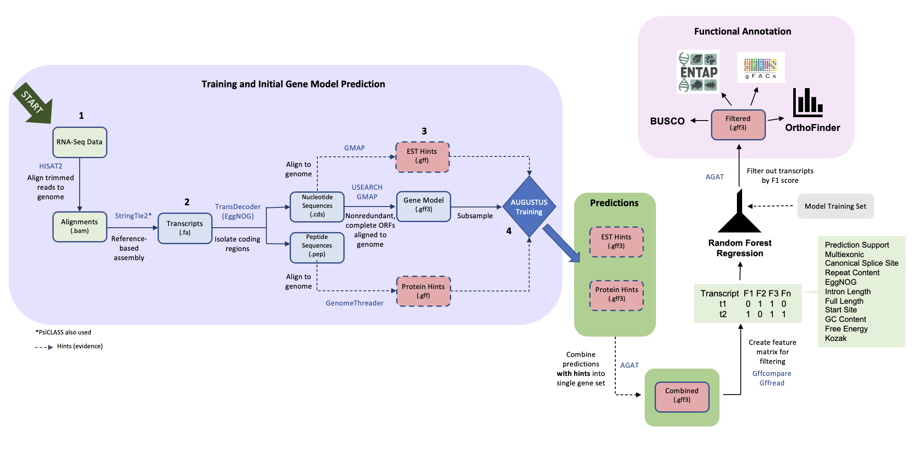

## Method

EASEL is a pipeline that relies on several methods and subworkflows. Here, each step of the method is described in terms of its input and output, and what is being accomplished at each step in the workflow.

1. [Data gathering](#data-gathering)
2. [Training and initial gene model prediction](#training-and-initial-gene-model-prediction)
- [Gene models for AUGUSTUS training](https://gitlab.com/PlantGenomicsLab/easel-augustus-training/-/blob/main/Files/2_generating_gene_models.md)
- [Generating hints for AUGUSTUS prediction](https://gitlab.com/PlantGenomicsLab/easel-augustus-training/-/blob/main/Files/3_hints_for_augustus.md)
- [AUGUSTUS prediction with hints](https://gitlab.com/PlantGenomicsLab/easel-augustus-training/-/blob/main/Files/4_Augustus_with_hints.md)
3. [Augustus ab initio predictions](#augustus-ab-initio-predictions)
4. [Merging predictions](#merging-predicitons)
6. [Evaluation](https://gitlab.com/PlantGenomicsLab/easel-augustus-training/-/blob/main/Files/6_evaluation.md)
7. [Results](https://gitlab.com/PlantGenomicsLab/easel-augustus-training/-/blob/main/Files/7_Results.md)



## Nextflow cascade

The `nextflow.sh` calls on `main.nf` to start EASEL. `main.nf` contains the nextflow command, paths to files, and options that can be set during a run. `main.nf` calls on workflows in the `./workflows` directory, specifically the `main_workflow.nf`. The `main_workflow.nf` includes subworkflows that initate data gathering, transcriptome assemlbies with psiclass and stringtie2, workflows leading to AUGUSTUS predictions, prediction filtering, and finally summary statistics on predictions.

Subworkflow statements in `main_workflow.nf`

```
include { data_input } from '../subworkflows/data_preparation.nf'
include { assembly_psiclass } from '../subworkflows/psiclass.nf'
include { assembly_stringtie2 } from '../subworkflows/stringtie2.nf'
include { stringtie2_psiclass } from '../subworkflows/filter_predictions.nf'
include { summary_stats } from '../subworkflows/quality_metrics.nf'
```


## Data Gathering

Gene model predictions are primarity generated through aligning transcriptomic data to soft-masked reference genome sequences and *ab initio* prediction ([1](#1.)). EASEL takes as input: 
- soft-masked reference genome (.fa)
- Paired-end RNA-Seq reads (SRA accession numbers or as .fastq)

### nf: reads

Gather your reads from 

```
    withLabel: reads {
        module = '/isg/shared/modulefiles/fastp/0.23.2:/isg/shared/modulefiles/sratoolkit/2.11.3'
        executor = 'slurm'
        clusterOptions = '--qos=general'
        memory = '10G' 
        cpus = '4'
        queue = 'general'
    }
```

## Training and initial gene model prediction

## Augustus ab initio predictions

## Merging predictions


## References / Repositories

Links to citations and repositories for software used in EASEL pipeline.
<<<<<<< HEAD


=======
>>>>>>> 2771be53e037ffb6a9617e0c838050bd699b177c
